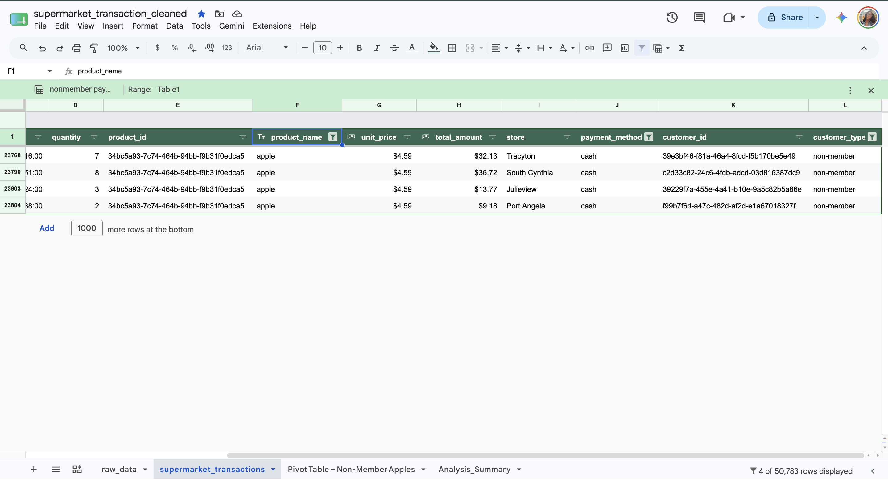
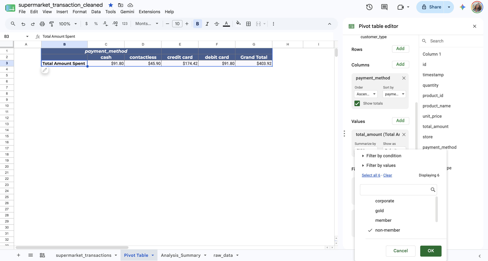

# Commonwealth Bank – Data Aggregation and Analysis  
### Forage Job Simulation

## 📊 Overview
This project was completed as part of the **Commonwealth Bank Data Analytics Virtual Experience** on Forage.  
The task involved analyzing supermarket transaction data to extract insights for InsightSpark’s data science team.

## 🎯 Objectives
- Aggregate and analyze the `supermarket_transaction.csv` dataset using **Google Sheets**.  
- Answer key business questions:
  - How many apples were purchased in cash?
  - How much total cash was spent on apples?
  - How much money was spent at the Bakershire store by non‑member customers?

---

## 🧾 Supermarket Transaction Analysis
This project demonstrates **data cleaning**, **aggregation**, and **visualization** using Google Sheets and Tableau.

### 📂 Cleaned Dataset
  
*Filtered dataset showing non‑member apple purchases.*

### 💰 Pivot Table Summary
  
*Pivot table comparing total spending by payment method for non‑member apple purchases.*

---

## 🛠 Tools & Techniques
- **Google Sheets** – data cleaning, aggregation, and formula documentation  
- **Tableau** – interactive visualization and trend analysis  
- **Data Filtering & Pivot Tables** – summarizing store‑level insights  

---

## 📈 Key Insights
- Apples purchased in cash varied significantly by location.  
- Bakershire store showed strong non‑member spending trends.  
- Visualization revealed clear correlations between payment methods and product categories.

---

## 🧠 Skills Demonstrated
- Data aggregation and filtering  
- Spreadsheet formulas and documentation  
- Tableau dashboard design  
- Business insight communication
